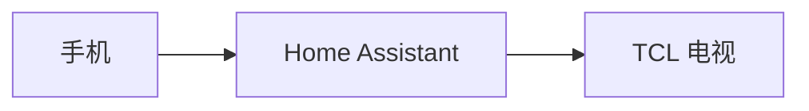

# 手机遥控 TCL 电视（Home Assistant Docker 最简方案）

本方案目标：**只用手机代替遥控器**控制 TCL 电视，**不需要**灯、传感器等自动化触发。与仓库里「米家灯 → 音箱」那条主线**相互独立**，可单独使用。

---

## 你要实现什么

| 项目 | 说明 |
|------|------|
| 控制端 | 手机上的 **Home Assistant App**（功能最全）或 **米家 App**（视电视是否接入米家而定） |
| 中枢 | 家里电脑/树莓派上 **Docker 运行的 Home Assistant** |
| 被控端 | **TCL 智能电视**（与 HA 同一局域网优先） |
| 能力 | 开关机、音量、输入源、启动应用（**具体以集成实际支持为准**） |

---

## 整体架构

```text
手机（米家 App / Home Assistant App）
         ↓
Home Assistant Docker（本地）
         ↓ 局域网（或厂商云，视集成而定）
TCL 智能电视
  - 开关机 / 音量 / 输入源 / 应用
```



---

## 你需要准备什么

1. 已按仓库根目录 `README.md` 把 **Home Assistant Docker** 跑起来（`http://宿主机IP:8123` 能登录）。
2. 电视与运行 HA 的设备在**同一局域网**（或集成文档要求的网络条件）。
3. 知道电视的**局域网 IP**（路由器后台或电视网络设置里查看），例如 `192.168.1.50`。

---

## 第一步：在 Home Assistant 里添加电视

不同 TCL 机型内核不同（Android TV / Google TV / 其他），**没有唯一标准集成名称**，请按电视实际系统选择：

1. 打开 HA：**设置 → 设备与服务 → 添加集成**。
2. 在搜索框依次尝试与你电视相关的关键词，例如：
   - **Android TV Remote**（常见：TCL 安卓电视）
   - **Google TV**
   - **Google Cast**（部分投屏/控制场景）
   - **Roku**（若你的 TCL 是 Roku 系统）
   - **TCL**（若有官方或社区集成，以当时 HA 版本列表为准）
3. 按向导填写 **电视 IP**、配对码（若提示）等。
4. 添加成功后，在 **开发者工具 → 状态** 里找到电视对应的 **`media_player.xxx`**（或同时有 **`remote.xxx`**），记下 **实体 ID**，下文用 `media_player.tcl_75t7l` 仅作**占位示例**，请换成你自己的。

> **说明**：若电视已加入 **米家**，也可在 HA 中通过 **小米相关集成** 接入；此时米家 App 能直接开关、调音量，但「切源 / 启动某 App」往往仍建议在 HA 里用媒体实体或脚本完成。

---

## 第二步：在「开发者工具 → 服务」里测试

把下面 `media_player.tcl_75t7l` **全部替换**为你的实体 ID。  
部分服务名或 `data` 字段因集成而异：若调用失败，请在 **开发者工具 → 服务** 里选中你的 `media_player`，看右侧**自动补全**支持哪些 `service` 与参数。

### 开关机

```yaml
# 开机
service: media_player.turn_on
target:
  entity_id: media_player.tcl_75t7l
```

```yaml
# 关机
service: media_player.turn_off
target:
  entity_id: media_player.tcl_75t7l
```

### 音量（0.0～1.0）

```yaml
service: media_player.volume_set
target:
  entity_id: media_player.tcl_75t7l
data:
  volume_level: 0.3
```

### 切换输入源

`source` 的可选值与电视/集成有关，可先在 HA 里该实体属性中查看 **source_list**。

```yaml
service: media_player.select_source
target:
  entity_id: media_player.tcl_75t7l
data:
  source: "HDMI1"
```

### 启动应用（可能因集成而异）

部分集成提供 `media_player` 上的应用相关能力，也可能使用 **`remote`** 实体或 **Android Debug Bridge** 类服务。若下面调用报错，请以你 HA 里该集成文档为准。

```yaml
service: media_player.play_media
target:
  entity_id: media_player.tcl_75t7l
data:
  media_content_id: "YouTube"
  media_content_type: "app"
```

部分环境也可能使用（**仅当服务列表中存在时**）：

```yaml
service: media_player.select_source
target:
  entity_id: media_player.tcl_75t7l
data:
  source: "YouTube"
```

---

## 第三步：手机怎么用

| 方式 | 适合做什么 |
|------|------------|
| **Home Assistant App**（推荐） | 同一 WiFi 下访问 `http://HA的IP:8123`，在仪表盘里放电视卡片，可尽量接近「全功能遥控器」（取决于集成）。 |
| **米家 App** | 若电视在米家：日常开关、音量方便；**高级能力**（精细切源、打开指定 App）往往仍需在 HA 里做脚本或面板。 |

---

## 第四步（可选）：脚本 + 面板当「遥控器」

可把常用操作写成 **脚本（script）**，在 Lovelace 里放 **按钮卡片** 一键调用。示例片段见：

`homeassistant-config/examples/tcl_tv_scripts.snippet.yaml`

把其中的 `media_player.tcl_75t7l` 换成你的实体 ID，将片段**合并**进 `configuration.yaml`（不要重复顶层 key）。

---

## 与本仓库其他内容的关系

- **不需要**「灯开 → 自动开电视」类自动化；本文件**不依赖**米家灯、Bose 音箱。
- Docker 与 `docker-compose.yml` 与主 README **共用**即可。

---

## 常见问题（FAQ）

**Q：找不到 TCL 集成？**  
A：优先试 **Android TV Remote / Google TV**，多数 TCL 智能电视基于安卓体系；以当前 HA 版本「添加集成」列表为准。

**Q：`launch_app` 或启动 YouTube 失败？**  
A：不同集成服务名不同；请在 **开发者工具 → 服务** 中查看该实体支持的服务，或查阅该集成官方说明。

**Q：关机后无法再开机？**  
A：部分电视关机后仅保留**有线网/WiFi 待机**，无线唤醒能力因型号而异；必要时用带红外/HDMI CEC 的其它方案，本文不展开。

---

祝你在手机上把 TCL 电视控顺：HA Docker 常驻，实体测通后再做面板美化即可。
